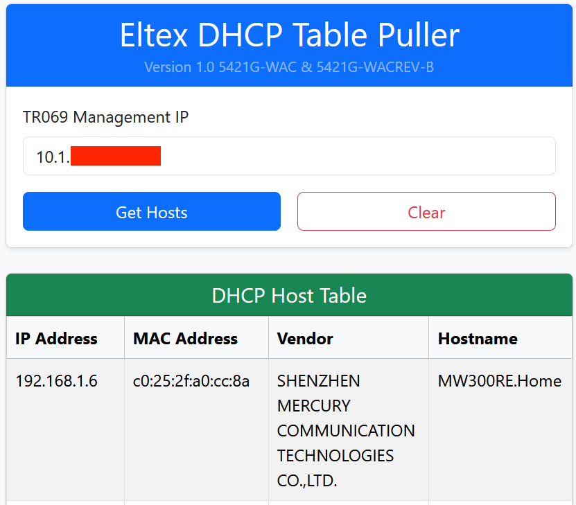

# ELTEX DHCP PULLER
Egyszeru webes app ami Eltex ONT DHCP tablabol kiszedi az IP-t, MAC-et, vendor infot, es hostname-et telnettel.
Fontos megjegyeznem hogy csak az 5421G-WAC es 5421G-WAC-REVB modellekkel mukodik (egyenlore)
Ajanlok VPN kapcsolatot ha remote-bol dolgozunk a TR069 managment ip-t hasznaljuk vagy lokalisan az eltex 192.168.1.1 cimen elerheto

## Mire jo?

- Bejelentkezes webre selenium-mal
- DHCP tabla feldolgozasa
- MAC vendor lookup helyi SQLite adatbazisbol
- Telnet hostnamek lekerese
- Mindent megjelenit weboldalon

## Szukseges
- Python 3.10+
- Google Chrome
- ChromeDriver
- .env fajl router adatokkal

## Pelda az inditashoz:

### .env Generalasa
 Az `.env` fajlba kerulnek az erzekeny adatok amiket a script hasznal (username-password stb), ez nelkulozhetetlen az inditashoz, es szukseges legeneralnunk.
 Konnyeden letudod generalni;

 ## Futtatas

Windows:
Siman csak futtasd a `deploy_windows/start.bat` fajlt

 - Letrehozza a virtualis kornyezetet (venv)
 - Telepiti a `requirements.txt`-ben leirt szukseges konyvtarakat, venv-be mindent telepit amire szukseg van (flask,selenium stb.)
 - Lefuttatja az `env_generator/env_generator.py` fajlt ahol betudod vinni a parametereket, ha megvagy, esetleg nyisd meg es    ellenorizd le az `env` fajlt, lasd az `.env.example` fajlt, atjavithatod illetve ujra le is tudod generalni
 - Ha ujrafuttatod az appot es ha mar van `.env` fajl akkor a meglevo `.env`-bol fogja huzni a parametereket
 

 Docker buildelese es futtatasa:
 Dockerben mar gunicorn is hozza van adva igy egyszerre tobb kerest is tud kezelni parhuzamosan `dockerfile`-ban skalazhato

 Fontos hogy a `.env` fajlt generaljuk le! Csak igy fug mukodni normalisan az app!

 Utana epitsuk meg a az imaget: 

 `docker build -t eltex_dhcp_puller . `

 Majd futtatjuk:

 `docker run -d -p 5055:5055 --env-file .env --name eltex_dhcp eltex_dhcp_puller`

  Fontos hogy az `--env-file .env` legyen hozzaadva mivel az erzekeny adatokat a bejelentkezeshez innen fogja behuzni a docker
